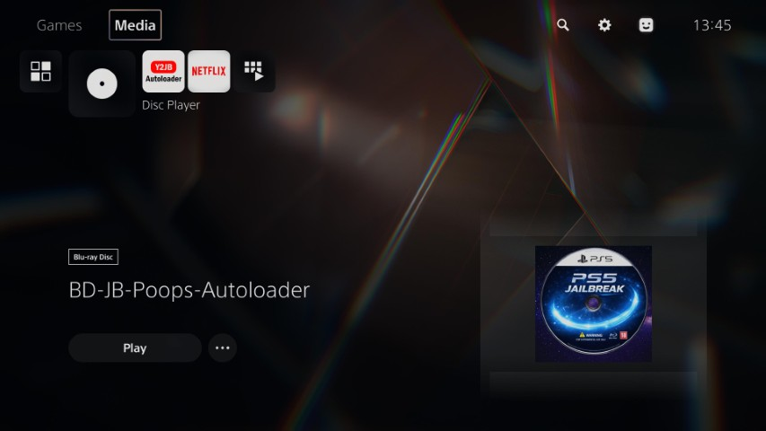

# BD-JB-Poops-Autoloader



## About this project

This project is based on [BD-UN-JB-Poops-Autoloader](https://github.com/owendswang/BD-UN-JB-Poops-Autoloader)
by [owenswang](https://github.com/owendswang), which is a fork of [BD-UN-JB](https://github.com/Gezine/BD-UN-JB)
by [Gezine](https://github.com/Gezine). BD-JB-Poops-Autoloader takes advantage of an exploit in the PS5 Blu-ray stack, which
allows execution of [NetPoops-PS5](https://github.com/MassZero0/NetPoops-PS5) to take full control of the PS5 kernel.

## Requirements

* PS5 with firmware <=7.61 or up to 12.00 using [SWRR](https://limitedrungames.com/products/limited-run-290-star-wars-racer-revenge-premium-edition-ps4) and [BD-UN-JB](https://github.com/Gezine/BD-UN-JB) to unpatch the Blu-ray stack. 
* Alternatively, you can use an existing jailbreak such as [YTJB](https://github.com/Gezine/Y2JB) or [Netflix-N-Hack](https://github.com/NetflixNHack/Netflix-N-Hack) to unpatch the Blu-ray stack on firmware up to 10.01.
* Blu-ray drive and BD-RE or BD-R disc to burn the ISO.

## Features

* ps5_autoload.elf which allows you to load ELF payloads from a USB device.
* ps5_killdiscplayer.elf automatically closes the disc player.
* NetPoops-PS5, sys_netcontrol UAF kernel exploit by MassZero0.

## How to use

* Download the [latest release](https://github.com/r-freeman/BD-JB-Poops-Autoloader/releases/latest/download/BD-JB-Poops-Autoloader.iso).
* Burn the ISO to BD-R or BD-RE using ImgBurn.
* Format a USB flash drive as exFAT or FAT32.
* Create `ps5_autoloader` directory on root of the USB flash drive.
* In the `ps5_autoloader` directory create an `autoload.txt` file.
* Edit `autoload.txt` with the ELF payloads you want to execute (one per line).
* Copy the payloads into the `ps5_autoloader` directory.
* Eject the USB flash drive and plug it into your PS5.
* Insert the Blu-ray disc into your PS5 and launch the exploit.
* If the exploit was successful it should load the payloads from the autoload.txt.
* Use etaHEN's built in FTP server (port 1337) to copy the `ps5_autoloader` directory to `/data`.
* You can now disconnect the USB flash drive.

Example autoload.txt:

```console
kstuff.elf
etaHEN.elf
```

## Build and compile

Use Debian-based environment to build and compile the project. I'm
using [wsl](https://learn.microsoft.com/en-us/windows/wsl/install) with Ubuntu distribution on Windows 11. After installing wsl
and Ubuntu, start the environment using `wsl -d Ubuntu` and follow the instructions below to install the project dependencies.

### Set up bdj-sdk

```console
ryan@localhost:~$ sudo apt-get update && sudo apt-get upgrade
ryan@localhost:~$ sudo apt-get install build-essential libbsd-dev git pkg-config openjdk-8-jdk-headless
ryan@localhost:~$ git clone --recurse-submodules https://github.com/john-tornblom/bdj-sdk
ryan@localhost:~$ ln -s /usr/lib/jvm/java-8-openjdk-amd64 bdj-sdk/host/jdk8
ryan@localhost:~$ ln -s /usr/lib/jvm/java-11-openjdk-amd64 bdj-sdk/host/jdk11
ryan@localhost:~$ make -C bdj-sdk/host/src/makefs_termux
ryan@localhost:~$ make -C bdj-sdk/host/src/makefs_termux install DESTDIR=$PWD/bdj-sdk/host
ryan@localhost:~$ make -C bdj-sdk/target
```

### Set up ps5-payload-sdk

Install dependencies

```console
ryan@localhost:~$ sudo apt-get install zip bash clang-18 lld-18
ryan@localhost:~$ sudo apt-get install socat cmake meson pkg-config
```

Download and install ps5-payload-sdk

```console
ryan@localhost:~$ wget https://github.com/ps5-payload-dev/sdk/releases/latest/download/ps5-payload-sdk.zip
ryan@localhost:~$ sudo unzip -d /opt ps5-payload-sdk.zip
ryan@localhost:~$ sudo rm ps5-payload-sdk.zip
```

E: Unable to locate package clang-18

```console
ryan@localhost:~$ wget -qO- https://apt.llvm.org/llvm.sh | bash -s -- 18
```

### Compile the project

Use `make` at the project root to compile ps5_autoload.elf, ps5_killdiscplayer.elf and BD-JB-Poops-Autoloader.iso. Burn the ISO to
disc using ImgBurn or similar software.

### Todo

- [x] Add CI/CD pipeline using GitHub Actions.

---

### Credits

* **[MassZero0](https://github.com/MassZero0)** — [NetPoops-PS5](https://github.com/MassZero0/NetPoops-PS5).
* **[owendswang](https://github.com/owendswang)** — [BD-UN-JB-Poops-Autoloader](https://github.com/owendswang/BD-UN-JB-Poops-Autoloader).
* **[jaigaresc](https://github.com/jaigaresc)** — [Poops-PS5-Java](https://github.com/jaigaresc/Poops-PS5-Java).
* **[Gezine](https://github.com/Gezine/BD-UN-JB)** — BD-UN-JB for basics.  
* **[TheFlow](https://github.com/theofficialflow)** — BD-JB documentation & native code execution sources.  
* **[hammer-83](https://github.com/hammer-83)** — PS5 Remote JAR Loader reference.  
* **[john-tornblom](https://github.com/john-tornblom)** — [BDJ-SDK](https://github.com/john-tornblom/bdj-sdk) and [ps5-payload-sdk](https://github.com/ps5-payload-dev/sdk/) used for compilation.  
* **[kuba--](https://github.com/kuba--)** — [zip](https://github.com/kuba--/zip) used for bdj_unpatch and ps5_autoload elf payload.  
* **[jaigaresc](https://github.com/jaigaresc/Poops-PS5-Java)** — used for jar payload.
* **[itsPLK](https://github.com/itsPLK/ps5_y2jb_autoloader):** Autoloader theory.
* **[BenNoxXD](https://github.com/BenNoxXD/PS5-BDJ-HEN-loader):** Method to close disc player.
* **[drakmor](https://github.com/drakmor):** [ftpsrv](https://github.com/drakmor/ftpsrv), [kstuff](https://github.com/drakmor/kstuff-lite), [shadowmountplus](https://github.com/drakmor/ShadowMountPlus).

---

## Disclaimer

This tool is provided as-is for research and development purposes only.  
Use at your own risk.  
The developers are not responsible for any damage, data loss, or other consequences resulting from the use of this software.  

